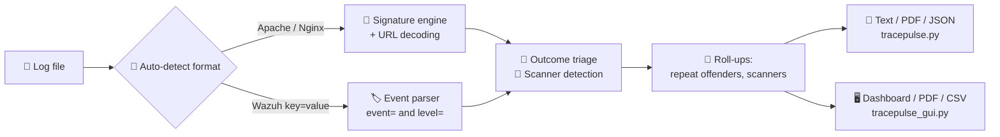

# TracePulse
Log analyzer and incident dashboard: finds attack patterns in web and Wazuh-style logs
<div align="center">

# 🛡️ TracePulse

### See what your attacks left behind, the way a defender sees it.

**A log analyzer and incident dashboard that finds attack patterns in web server logs and Wazuh-style security logs, tells you whether each attack was blocked or may have worked, and turns the result into a clean report.**


[Features](#-features) • [Quick Start](#-quick-start) • [Dashboard](#-the-dashboard) • [What It Detects](#-what-it-detects) • [How It Works](#-how-it-works) • [Limitations](#-honest-limitations)

<br>


<sub>The dashboard analyzing a Wazuh-style log. Lab practice data only.</sub>

</div>

---

## 💡 Why TracePulse?

When you fire a SQL injection at a lab target, you see **your side**: the payload worked, or it didn't.

The server's log tells a different story. Was the request **blocked** (403)? Did it cause a **server error** (500)? Or did it slip through with a plain **200**?

> **That gap between the attacker's view and the defender's view is what TracePulse closes.**

It reads the logs your testing leaves behind, finds the attacks, and answers the question an analyst asks next: **"Did it work, and what should I do about it?"**

| 🔴 Attacker view | 🔵 Defender view (TracePulse) |
|---|---|
| "My payload returned data." | "That request got HTTP 200. **Review first.**" |
| "I ran 3,000 requests with a scanner." | "One roll-up incident: Nikto from one IP, with a status-code mix." |
| "Nothing came back." | "403. Blocked. Lower urgency." |

Built with a **purple team mindset**: use attack knowledge to build better detection.

---

## ✨ Features

### 🔎 Detection engine (`tracepulse.py`)

- 🧠 **Auto-detects the log format.** No flags needed: Apache/Nginx combined logs and Wazuh-style `key=value` logs are recognized automatically.
- 🕵️ **Finds known attack patterns**: SQL Injection, XSS and Directory Traversal in web logs, plus 13 event types in Wazuh-style logs (brute force, port scans, web shells, privilege escalation and more).
- 🔓 **Decodes URLs before matching.** Payloads like `%20UNION%20SELECT` are caught even when percent-encoded (decoded up to twice to catch double-encoding).
- 🚦 **Outcome triage.** Every alert is tagged *possible success / server error / blocked / failed / redirected / unknown*, so "attempted" is separated from "may have worked".
- 🤖 **Scanner detection.** Recognizes 20 attack and scan tools from the User-Agent (sqlmap, Nikto, Nmap, Gobuster, Hydra and more) and rolls thousands of scanner requests into **one incident per IP and tool**.
- 🔁 **Repeat-offender correlation.** Groups incidents by source, so one IP doing several different attacks shows up as one clear line.
- ✅ **Concrete recommended action** for every alert, adjusted by outcome (an unblocked attack gets a `PRIORITY` prefix).
- ⚠️ **Never says "clean" when it couldn't read the log.** If no line matches a known format, you get a warning, not a false "0 alerts".
- 📄 **Three export formats:** text, PDF, JSON.
- 📂 **Takes a log from anywhere** on your computer, by path or by interactive prompt.

### 🖥️ Local web dashboard (`tracepulse_gui.py`)

- 📊 KPI cards, bar charts, outcome donut, severity donut and an alerts-over-time timeline
- 🔍 Searchable, filterable, paginated incident list (up to 500 rows per page)
- ⬇️ One-click **PDF report with charts** and a **full CSV export**
- 🔒 Runs only on `127.0.0.1`. Your logs never leave your machine.

---

## 🚀 Quick Start

### 1️⃣ Install

```bash
git clone https://github.com/YOUR-USERNAME/TracePulse.git
cd TracePulse
pip install -r requirements.txt
```

> Only one external package is needed: **ReportLab** (for PDF reports). Everything else is Python's standard library.

### 2️⃣ Try it on the included samples

```bash
# Web server log (Apache/Nginx combined format)
python tracepulse.py --log samples/sample_web_access.log

# Wazuh-style security event log
python tracepulse.py --log samples/sample_wazuh_events.log
```

### 3️⃣ Or launch the dashboard

```bash
python tracepulse_gui.py
```

Your browser opens at `http://127.0.0.1:8765`. Pick a log file and click analyze.

---

## 🧰 Command-Line Usage

```bash
python tracepulse.py                                   # interactive: asks for the log path
python tracepulse.py --log access.log                  # print the report
python tracepulse.py --log access.log --output r.txt   # also save a text report
python tracepulse.py --log access.log --pdf r.pdf      # also save a PDF
python tracepulse.py --log access.log --json r.json    # also save JSON
python tracepulse.py --log /any/path/on/disk/app.log   # absolute or relative paths both work
```

| Flag | What it does |
|---|---|
| `--log PATH` | Log file to analyze. If missing or not found, TracePulse asks for a path. |
| `--output PATH` | Save the plain-text report as well as printing it. |
| `--pdf [PATH]` | Save a styled PDF. With no path, it suggests `<log_name>_soc_report.pdf`. |
| `--json [PATH]` | Save machine-readable JSON (for SIEM or ticketing pipelines). |

> 💬 Run it with **no arguments in a terminal** and it will also offer to save a PDF at the end.

**Dashboard options**

```bash
python tracepulse_gui.py --port 9000        # use a different port (default 8765)
python tracepulse_gui.py --no-browser       # don't open the browser automatically
```

If the port is taken, the dashboard tries the next 19 ports automatically.

---

## 🎯 What It Detects

### 🌐 Web attacks (Apache/Nginx logs)

| Attack | What it is | What TracePulse looks for |
|---|---|---|
| 💉 **SQL Injection** | Tricking a database query with crafted input | Quotes (`'`, `%27`), comment markers (`--`, `#`), `OR`/`AND`/`UNION`/`SELECT` near `FROM`/`WHERE`/`=` |
| 📜 **Cross-Site Scripting (XSS)** | Getting a page to run attacker script | `<script>` tags (raw or encoded), `javascript:`, `onerror=`, `onload=`, `alert(` |
| 📂 **Directory Traversal** | Escaping a folder to read other files | `../`, `..\`, encoded variants, `/etc/passwd`, `boot.ini`, `win.ini` |

### 🖧 System and network events (Wazuh-style logs)

These lines already carry an `event=` label, so TracePulse uses it directly and keeps the log's own `level=` as the severity.

| Event | Shown as |
|---|---|
| `SQL_INJECTION_ATTEMPT` | SQL Injection Attempt |
| `DIRECTORY_TRAVERSAL` | Directory Traversal |
| `SSH_BRUTE_FORCE` | SSH Brute Force |
| `RDP_BRUTE_FORCE` | RDP Brute Force |
| `PORT_SCAN` | Port Scan |
| `WINDOWS_FAILED_LOGON` | Windows Failed Logon |
| `SUSPICIOUS_POWERSHELL` | Suspicious PowerShell Activity |
| `WEB_SHELL_ACTIVITY` | Web Shell Activity |
| `SUSPICIOUS_SUCCESSFUL_LOGIN` | Suspicious Successful Login (Geo Anomaly) |
| `PRIVILEGE_ESCALATION` | Privilege Escalation |
| `SUSPICIOUS_OUTBOUND_CONNECTION` | Suspicious Outbound Connection (Possible C2) |
| `SUSPICIOUS_FILE_CREATED` | Suspicious File Created (Possible Malware) |
| `DNS_TUNNELING_INDICATOR` | DNS Tunneling Indicator |

`NORMAL_ACTIVITY` and `ANALYST_ACTIVITY` are treated as routine and skipped. Any **other** `event=` value is still reported, with a readable name generated from the code.

<details>
<summary><b>🤖 Scanner and attack tools recognized (click to expand)</b></summary>

<br>

Identified from the **User-Agent** header: `sqlmap`, `Nikto`, `Nmap Scripting Engine`, `Masscan`, `Gobuster`, `DirBuster`, `dirb`, `Wfuzz`, `ffuf`, `Hydra`, `Nuclei`, `WPScan`, `Acunetix`, `Nessus`, `OpenVAS`, `w3af`, `Arachni`, `Metasploit`, `Burp Suite`, `OWASP ZAP`.

> ⚠️ Burp Suite and ZAP send a normal browser User-Agent by default, so they only appear if the tester changed it. **No match does not prove traffic is human.**

</details>

---

## 🚦 Outcome Triage: "Did It Work?"

A signature match only says someone **tried** something. TracePulse then looks at the server's response.

| Outcome | HTTP status | What it means |
|---|---|---|
| 🔴 **Possible success** (review first) | `2xx` | Not blocked. Check whether data was exposed or the payload ran. |
| 🟠 **Server error** | `5xx` | The payload may have reached the app or database. Check error logs. |
| 🟡 **Redirected** | `3xx` | Inconclusive. Verify the destination response. |
| 🟢 **Blocked / denied** | `400`, `401`, `403`, `406`, `429` | The attempt appears blocked. Lower urgency. |
| 🔵 **Failed / not found** | `404`, `410` | The attempt appears to have failed. Lower urgency. |
| ⚪ **Unknown** | anything else, or no status | Not enough information. |

For Wazuh-style logs, the outcome comes from the line's own `action=` field instead: `BLOCKED`, `DENIED`, `DROPPED`, `REJECTED`, `PREVENTED` count as blocked, and `ALLOWED`, `PERMITTED`, `ACCEPTED`, `PASSED` count as not blocked.

> 🧠 **Severity and outcome are two different questions.**
> *Severity* = "how dangerous is this kind of attack?" *Outcome* = "what did the server actually do this time?"
> A critical SQL injection that got a **403** is less urgent than a low-severity probe that got a **200**. You need both views.

> ⚠️ Status-code triage is a **heuristic, not proof**. Many apps return `200` with an error page, and a `403` doesn't guarantee nothing leaked. Use it to decide what to review first, then verify.

---

## 🖥️ The Dashboard

<div align="center">

<br>
<sub>The same dashboard on a web server log. Severity shows "no severity field" because web logs don't carry one.</sub>
</div>

<br>

| Section | What you get |
|---|---|
| 🚨 **Banner** | Tells you how many alerts need review first, or warns if the log couldn't be parsed |
| 🔢 **KPI cards** | Total alerts, unique sources, need review first, critical/high (when available), repeat offenders, scanner tools |
| 📊 **Attacks by type** | Bar chart of every attack category |
| 🍩 **Outcome triage** | Donut of blocked / failed / possible success / server error / redirected |
| 🌍 **Top attacking sources** | Top 10 sources, repeat offenders (3+ incidents) highlighted |
| 🎚️ **Severity levels** | Donut by CRITICAL / HIGH / MEDIUM / LOW (for logs that include severity) |
| ⏱️ **Alerts over time** | Per hour, or per day if the log spans more than 3 days |
| 🔍 **Incident list** | Search by IP, URI or detail, filter by attack type and outcome, paginate (50 / 100 / 250 / 500 rows) |
| 📖 **Recommended actions** | A next step for each attack type, plus a per-incident "View" |
| ⬇️ **Exports** | PDF report with charts, and a CSV of **all** incidents |

**CSV columns:** `#`, `attack_type`, `severity`, `source`, `timestamp`, `outcome`, `http_status`, `scanner_tool`, `target_detail`, `log_line`, `recommended_action`

---

## 📋 Example Output

Running the CLI on `samples/sample_web_access.log`:

```text
==============================================================
               TRACEPULSE SOC INCIDENT SUMMARY
==============================================================
Source Log     : samples/sample_web_access.log
Detected Format: Apache/Nginx combined access log
Lines Read     : 12
Lines Parsed   : 12  (Skipped: 0)
Total Alerts   : 11
==============================================================
            TOP ATTACKING IPs (by incident count)
--------------------------------------------------------------
  192.0.2.44      5 incident(s)  Automated Scanner Detected, SQL Injection  [REPEAT OFFENDER]
  198.51.100.88   4 incident(s)  Automated Scanner Detected, Directory Traversal  [REPEAT OFFENDER]
  203.0.113.201   2 incident(s)  Cross-Site Scripting (XSS)
==============================================================
           TRIAGE SUMMARY (what did the server do?)
--------------------------------------------------------------
     2  Possible success (review first)
     1  Server error (payload may have reached app)
     4  Blocked / denied
     1  Failed / not found
     1  Redirected (inconclusive)
==============================================================
SCANNER / ATTACK TOOLS DETECTED (from User-Agent)
--------------------------------------------------------------
  192.0.2.44         sqlmap
  198.51.100.88      Nikto
==============================================================
[ALERT] Attack Type : SQL Injection
[INFO]  Source (IP/Host): 192.0.2.44
[INFO]  Timestamp    : 29/Sep/2026:08:02:40 +0000
[INFO]  Target/Detail: /product.php?id=7%27%20OR%20%271%27=%271
[INFO]  Outcome      : Possible success (HTTP 200)
[INFO]  Log Line #   : 3
[INFO]  Action       : PRIORITY - the request was not blocked; check
                       whether data was exposed or the payload executed...
```

On `samples/sample_wazuh_events.log`, TracePulse parses **126 of 126 lines** and reports **82 alerts**.

---

## 🧩 How It Works



1. **Detect format.** TracePulse peeks at the first real line to decide: combined web log, Wazuh-style log, or unknown.
2. **Read line by line.** The file is streamed, never loaded whole, so memory doesn't grow with file size.
3. **Match.** Web lines: the URI is percent-decoded and checked against the signatures. Wazuh lines: the `event=` label is used directly.
4. **Triage.** Each alert gets an outcome and a recommended action. Scanner traffic is rolled up per IP and tool.
5. **Report.** Incidents are summarized, ranked by source, and exported.

**Parse statistics are always shown** (lines read, parsed and skipped) so a `0 alerts` result can be told apart from a log that simply couldn't be read.

---

## ⚡ Performance

Measured on a synthetic web log of **2,000,000 lines (186 MB)** with about 1% attack traffic:

| Measure | Result |
|---|---|
| ⏱️ Time | about **25 seconds** |
| 🧠 Peak memory | about **130 MB** (with about 20,000 alerts held in memory) |
| ✅ Lines parsed | 2,000,000 of 2,000,000 |

Results will vary with your hardware. Memory depends mostly on **how many alerts are found**, not how many lines the file has.

**Dashboard limits:** uploads are capped at **4 GB** per file (streamed to disk), and the **last 10 analyses** are kept in memory for PDF and CSV download.

---

## ⚠️ Honest Limitations

TracePulse is a **triage and reporting aid**, not a replacement for a WAF or SIEM.

- 📚 **Known patterns only.** Signature-based detection can't recognize an attack it has never been taught, which is how most antivirus and IDS tools work too.
- 🔤 **Evadable.** Unusual encodings, payloads split across parameters or requests, and obfuscation can slip past regex signatures.
- 👻 **URI only.** Attacks sent in POST bodies, headers or cookies don't appear in a standard access log, so they are invisible to it.
- 📁 **Static files, not live streams.** There is no real-time monitoring or alerting.
- 🎲 **Heuristic outcomes.** HTTP status codes suggest whether an attack worked. They don't prove it.
- 🏷️ **Wazuh-style logs trust the log's own `event=` label.** TracePulse does not re-derive it.
- 🧪 **Tested on lab data.** The samples and screenshots use practice data, not production traffic.

---

## 🗂️ Project Structure

```text
TracePulse/
├── tracepulse.py          # 🧠 Detection engine and CLI (text, PDF, JSON)
├── tracepulse_gui.py      # 🖥️ Local web dashboard (imports tracepulse.py)
├── requirements.txt       # 📦 reportlab
├── samples/
│   ├── sample_web_access.log      # Apache/Nginx combined format
│   └── sample_wazuh_events.log    # Wazuh-style key=value format
└── screenshots/
    ├── dashboard_wazuh.png
    └── dashboard_web.png
```

> Keep `tracepulse.py` and `tracepulse_gui.py` **in the same folder**. The dashboard imports the engine, so there is a single source of truth for all detection logic.

---

## 🔧 Extending TracePulse

- **Add a web signature:** append a `(label, compiled_regex)` pair to the `SIGNATURES` list in `tracepulse.py`.
- **Add a scanner tool:** add a `(name, regex)` pair to `SCANNER_SIGNATURES`.
- **Add a recommended action:** add an entry to `RECOMMENDED_ACTIONS` keyed by the attack-type label.
- **Name a new Wazuh event:** add it to `EVENT_LABEL_OVERRIDES` (otherwise a readable name is generated automatically).

---

## 🗺️ Roadmap

- [ ] Behavior-based detection (rates, bursts, failed-then-successful logins), not just known signatures
- [ ] MITRE ATT&CK tags on every alert
- [ ] More log formats (JSON logs, IIS, cloud load balancers)
- [ ] POST body and header inspection where logs include them
- [ ] Live log tailing

---

## ⚖️ Responsible Use

TracePulse **reads logs**; it does not attack anything. It is intended for learning, lab testing, and analyzing logs from systems **you own or are authorized to assess**. Do not upload or share logs containing other people's private data.

---

## 📄 License

Released under the **MIT License**. Add a `LICENSE` file to the repository (GitHub offers an MIT template when you create the repo).

---

<div align="center">

### 🟣 Built with a purple team mindset

Attack knowledge makes better detection. Detection knowledge makes better attacks.

**Made by [Your Name](https://github.com/YOUR-USERNAME)** · ⭐ Star the repo if you found it useful!

</div>
